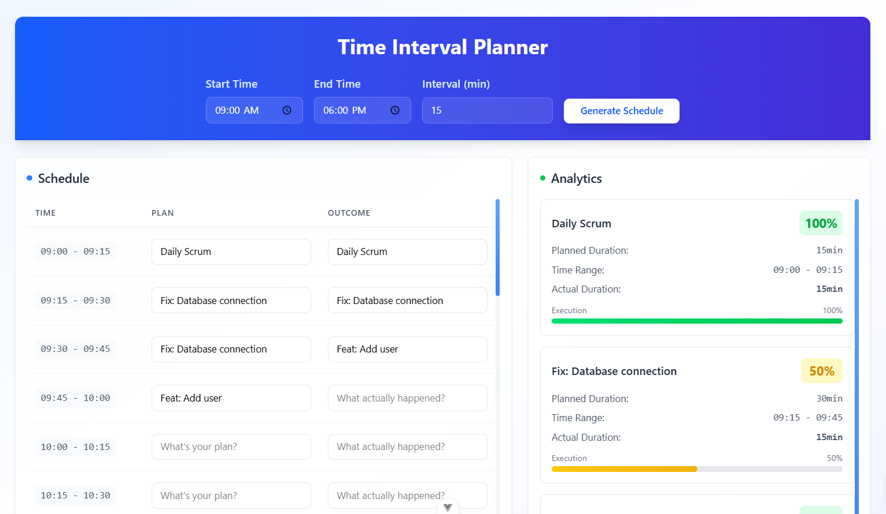

# Cairos

This is a daily scheduler that allows you to have 15 minute interval plans, and gives you a summary on your performance. This project is uses Vue3 with Vite and Tailwind CSS, and vibe-coded using Claude Sonnet 4.



## Getting Started

```
# Build the image
docker build -t cairos .

# Run the container
docker run -p 8080:80 cairos
```
